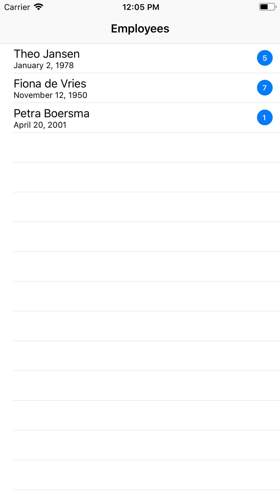

# IssueReader
> This repo is the result of an assignment that was sent to me by the [Rabobank](https://www.rabobank.nl).

[![Swift Version][swift-image]][swift-url]
[![Build Status][travis-image]][travis-url]
[![License][license-image]][license-url]
[](http://makeapullrequest.com)

The app launches and will immediately parse the CSV file. This CSV has for simplicity sake been packaged with the app bundle. The parsing happens asynchronous in the background where by the use of delegation informs the tableView of its progress.

By pulling down in the tableView you can trigger a refresh and see the app parse the CSV again.

<p align="center">
	
</p>

## The asssignment
Create an app that is capable of visualizing the attached csv file on the screen. parse it on a background thread.

## Requirements

- iOS 8.0+
- Xcode 7.3
- [CocoaPods](http://cocoapods.org/)

## Installation
Make sure you've got CocoaPods installed.
1. Run ```pod install```.  
2. Open the issueReader.xcworkspace file in Xcode.
3. Run the app in the simulator.

## Contribute

Please fork this project and do with it as you wish.

## Meta

Iain Munro – [@iain1711](https://twitter.com/iain1711) – iain@imunro.nl.

Distributed under the MIT license. See ``LICENSE`` for more information.

[swift-image]:https://img.shields.io/badge/swift-3.0-orange.svg
[swift-url]: https://swift.org/
[license-image]: https://img.shields.io/badge/License-MIT-blue.svg
[license-url]: LICENSE
[travis-image]: https://img.shields.io/travis/dbader/node-datadog-metrics/master.svg?style=flat-square
[travis-url]: https://travis-ci.org/dbader/node-datadog-metrics
[codebeat-image]: https://codebeat.co/badges/c19b47ea-2f9d-45df-8458-b2d952fe9dad
[codebeat-url]: https://codebeat.co/projects/github-com-vsouza-awesomeios-com